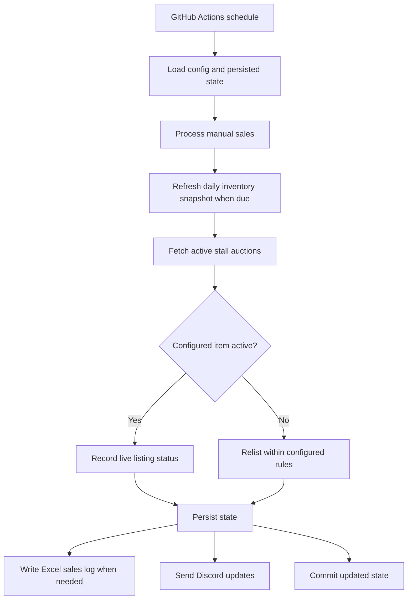

# Marketplace Auto-Lister

A scheduled Python bot that keeps configured CS2 auction listings active, records sales, and preserves state between runs.

The project is built for short scheduled executions rather than a continuously running process. Each run loads persisted state, reconciles live auction listings, relists items when needed, logs sales, refreshes the daily inventory snapshot when due, and commits updated state back to the repository.

## System Overview



## Core Behavior

| Capability | Description |
|---|---|
| Listing reconciliation | Reads configured items from `config.json` and compares them with the account's active auction stall listings |
| Automatic relisting | Recreates missing or expired listings using configured reserve prices, price decreases, and minimum floors |
| Sale tracking | Detects items no longer present in inventory, records sale details, and removes confirmed sold items from config |
| Manual sale intake | Processes entries from `manual_sales.json` and writes them into the workbook before clearing successfully handled entries |
| Daily inventory snapshot | Once per Toronto calendar day, on the first run at or after 2 AM, refreshes `prev_inventory_assets.txt` and `new_inventory_assets.txt` |
| Notifications | Sends Discord summaries for relists and failures |
| Persistent state | Stores active listing IDs, failure counts, pending sale prices, and snapshot timing across scheduled runs |

## Runtime

Normal unattended execution uses GitHub Actions:

- Scheduled every two hours at minute `05`
- Protected with workflow-level concurrency so Actions runs do not overlap
- Unlocks encrypted files with `git-crypt`
- Runs the bot
- Commits updated state files back to `main`
- Limits public Actions console output to errors while detailed runtime logs stay in the local encrypted log file

Only one live runner should be used at a time. Do not keep the old VM cron enabled while GitHub Actions is also running the bot, because two independent schedulers can race each other and make marketplace requests from separate IPs.

## State and Files

| Path | Role |
|---|---|
| `bot.py` | Main listing workflow |
| `config.json` | Configured items and listing rules |
| `bot_state.json` | Persisted sold state, active listings, failure counters, and daily snapshot date |
| `relist_counts.json` | Relist history per asset |
| `manual_sales.json` | Manual sale queue consumed at the start of a run |
| `CS_GO_PnL_Tracker_Final.xlsx` | Sales workbook updated by the bot |
| `prev_inventory_assets.txt` | Latest full inventory snapshot |
| `new_inventory_assets.txt` | Items first seen since the previous snapshot |
| `print_inventory_assets.py` | Standalone inventory snapshot utility |

## Reliability and Safety

| Area | Safeguard |
|---|---|
| Listing fetches | Uses the account stall endpoint and aborts relisting when live listing state cannot be fetched safely |
| API resilience | Retries transient GET and POST failures with backoff |
| State writes | Uses atomic JSON writes for config and state files |
| Sale logging | Preserves manual sale entries if workbook logging fails |
| Relist pacing | Sleeps between listing writes to reduce burst pressure |
| Secrets | Credentials are supplied through environment variables and protected repo files are encrypted with `git-crypt` |

## Running Locally

```bash
python bot.py
```

To print the current inventory snapshot in the terminal:

```bash
python print_inventory_assets.py
```

## Operator Notes

### Listing Template

Use this shape when adding a new configured listing:

```json
{
  "name": "",
  "asset_id": "",
  "reserve_price": 0,
  "description": "",
  "cost": 0,
  "decrease": 0,
  "lowest_sell": 0
}
```

| Field | Meaning |
|---|---|
| `decrease` | Amount to drop the reserve price each time an auction ends |
| `lowest_sell` | Floor price the bot will not go below |

### Manual Excel Add

Add entries to `manual_sales.json` in this format:

```json
{"name": "", "sold": 100, "cost": 50}
```

### Editing the Workbook

```python
import openpyxl

wb = openpyxl.load_workbook("CS_GO_PnL_Tracker_Final.xlsx")
ws = wb["CSGO PnL Tracker"]

ws["C286"] = 11.5

wb.save("CS_GO_PnL_Tracker_Final.xlsx")
```

Useful reminders:

- `load_workbook(path)` opens the workbook.
- `wb["Sheet Name"]` selects a sheet by name.
- `ws["C286"]` uses normal Excel cell notation.
- `wb.save(path)` writes changes back to disk.
- `wb.sheetnames` shows the available sheet names.

## Notes

- Marketplace-specific request details and pricing heuristics are intentionally kept in code and encrypted configuration rather than expanded in documentation.
- The bot is designed to favor recoverability and bounded behavior over maximum request volume.
