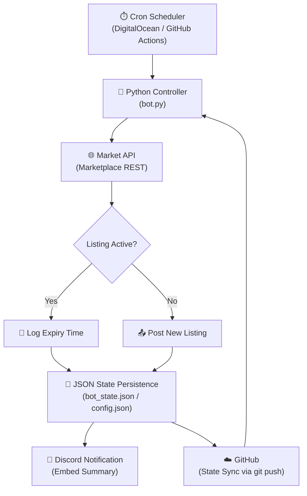

Key Functions: 
Runs every 2h 5m on odd interval: 1:05, 3:05, 5:05, 7:05, 9:05, 11:05, etc.
So the Bid bot and Listing bot never split API usage, and allows this script to have more runway as listings increase. 
The bot (bot.py):

Reads your items from config.json and credentials from .env
Calls GET /listings?user_id=... on Marketplace to check which of your items are currently on auction
If an item is listed → saves the expiry time and moves on
If an item isn't listed → lists it immediately via POST /listings
Sends a Discord embed summarising everything
Then exits

The cloud server (Digital Ocean Droplet):

$6/month Ubuntu VM running 24/7 in Toronto
Bot files live in /root/marketplace-bot
The bot runs via nohup ./run.sh & which keeps it alive in the background
run.sh pulls the latest code from GitHub before every run so it's always up to date

The 24h auction cycle:

Bot lists your items as 24h auctions on Marketplace
24h later the auction expires
Bot detects the listing is gone, waits 5 mins, relists it
Repeats forever

Bugs: 
If float fucks something up and the bot runs but cannot list etc it will place the orders in the config as sold or failed which fucks it up. If an item is in config but not listing check the bot state file

---

# Auto-Lister — System Overview

## Architecture

Every cycle: the scheduler triggers the controller, which checks live marketplace listings via REST, updates local JSON state, relists any expired items, and reports the outcome to Discord. Config and state are committed back to GitHub so every run starts from a clean, version-controlled snapshot.
human-readable, and requires no infrastructure. `bot_state.json` and `config.json` are committed to GitHub after every run, making state inspectable and recoverable without a database client. The tradeoff is acceptable: query complexity is low and the dataset is small.
