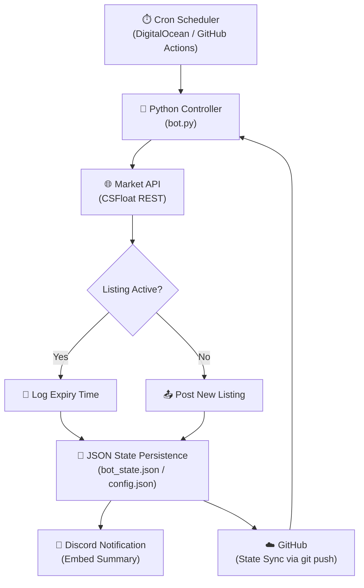

Key Functions: 

The bot (bot.py):

Reads your items from config.json and credentials from .env
Calls GET /listings?user_id=... on CSFloat to check which of your items are currently on auction
If an item is listed → saves the expiry time and moves on
If an item isn't listed → lists it immediately via POST /listings
Sends a Discord embed summarising everything
Then exits

The cloud server (Digital Ocean Droplet):

$6/month Ubuntu VM running 24/7 in Toronto
Bot files live in /root/csfloat-bot
The bot runs via nohup ./run.sh & which keeps it alive in the background
run.sh pulls the latest code from GitHub before every run so it's always up to date

The 24h auction cycle:

Bot lists your items as 24h auctions on CSFloat
24h later the auction expires
Bot detects the listing is gone, waits 5 mins, relists it
Repeats forever

Bugs: 
If float fucks something up and the bot runs but cannot list etc it will place the orders in the config as sold or failed which fucks it up. If an item is in config but not listing check the bot state file

---

# Auto-Lister — System Overview

> Automated CS2 marketplace trading system that monitors live listings, places competitive buy orders, and manages inventory. **130% ROI achieved.**

---

## The Problem

Manual CS2 skin trading is riddled with inefficiency. Market prices shift in minutes, arbitrage windows open and close before a human can react, and around-the-clock monitoring is impossible without automation. To capture value consistently, a system needs to:

- React in **sub-minute timeframes** to listing expirations and price movements
- Operate **24/7** without human intervention
- Maintain reliable state across restarts and deployments

Doing this manually means missed relists, stale pricing, and leaving money on the table. The solution was to automate the entire loop.

---

## Architecture

Every cycle: the scheduler triggers the controller, which checks live marketplace listings via REST, updates local JSON state, relists any expired items, and reports the outcome to Discord. Config and state are committed back to GitHub so every run starts from a clean, version-controlled snapshot.

---

## Technical Decisions

**Why Python?**
Python lets you go from API docs to a working integration in an afternoon. `requests` and `python-dotenv` cover everything needed — no framework overhead, no compilation step, fast iteration. For a project where the bottleneck is marketplace API rate limits rather than CPU, Python is the right tool.

**Why DigitalOcean + GitHub for infrastructure?**
A dedicated always-on server (DigitalOcean Ubuntu droplet, $6/month) eliminates the cold-start latency and execution time limits of pure serverless. GitHub acts as the source of truth — every run pulls the latest code and pushes state changes back, giving free version control, rollback capability, and a deployment pipeline with zero extra tooling. Together they deliver 24/7 uptime without the cost or complexity of a dedicated server setup.

**Why JSON for state management?**
At current inventory scale, a flat JSON file is fast, human-readable, and requires no infrastructure. `bot_state.json` and `config.json` are committed to GitHub after every run, making state inspectable and recoverable without a database client. The tradeoff is acceptable: query complexity is low and the dataset is small.

---

## Results

| Metric | Value |
|---|---|
| **ROI** | 130% |
| **Projected APR** | 335% |
| **Revenue generated** | 4-figure |
| **System uptime** | 24/7 |
| **Human intervention required** | Near zero |

---

## What I'd Do Differently

**WebSockets over polling.**
The current architecture polls the marketplace REST API on a fixed schedule. Moving to a WebSocket feed would drop reaction latency from minutes to milliseconds, capturing arbitrage opportunities that the polling window misses today.

**SQL database over JSON.**
JSON state files work at this inventory size, but they don't scale. As the number of tracked items grows, a lightweight SQL database (SQLite locally, PostgreSQL in production) would enable proper querying, indexing, and audit history without rewriting the core logic.

---

## Stack

- **Python** — core controller and API integration
- **REST APIs** — marketplace data and order placement
- **Multithreading** — concurrent listing checks across inventory
- **GitHub Actions / DigitalOcean** — scheduling and 24/7 execution
- **Discord Webhooks** — real-time operational alerts
